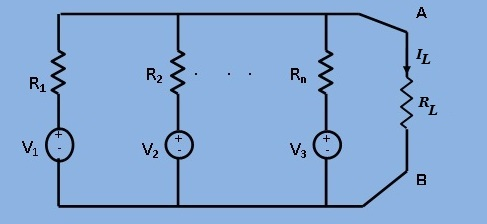
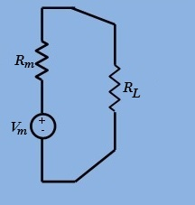

### Theory

To Verify  Millman's Theorem.  &nbsp;

							
This theorem is a combination of Thevenin's and Norton's theorems. 
							When a number of voltage sources (`V1`,`V2`,...,`Vn`) are in parallel having internal resistances (`R1`,`R2`,...,`Rn`) respectively, 
							the arrangement can be replaced by a single equivalent voltage source `Vm` 
							in series with an equivalent series resistance `Rm` as given below in Fig.1 and Fig.2.

							 <figure style="text-align:center">
									  
									  &nbsp;&nbsp;&nbsp;&nbsp;&nbsp;<figcaption> Fig.1&nbsp;A number of voltage source fading power to a load</figcaption>
									</figure>
									 
									 <figure style="text-align:center">
									  
									  <figcaption> Fig.2&nbsp;Equivalent voltage and resistance of the source network following millman's theorem</figcaption>
									</figure>
									 
									 
							        
As per Millman's Theorem ,

									
$$V_m = \frac{(+- V_1G_1 +- V_2G_2 +-.........+- V_nG_n)}{(G_1+G_2+.........+G_n)}$$
									
where $$G_i = \frac{1}{R_i}$$,&nbsp;&nbsp;&nbsp; $$i = 1,2,....,n$$
									
$$R_m = \frac{1}{G} = \frac{1}{(G_1+G_2+.........+G_n)}$$
									

This voltage represents the Millman's equivalent voltage `Vm`. 
The resistance `Rm` can be found , as usual , by replacing each voltage source by a short circuit. 
If there is a load resistance `RL` across the terminals A and B , 
then the load current `IL` is given by
 
							       
$$I_L = \frac{V_m}{(R_m + R_L)}$$
						
			
