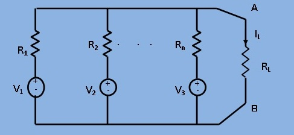

### Theory

To Verify  Millman's Theorem.  &nbsp;

							
This theorem is a combination of Thevenin's and Norton's theorems. When a number of voltage sources (`V1`,`V2`,...,`Vn`) are in parallel having internal resistances (`R1`,`R2`,...,`Rn`) respectively, the arrangement can be replaced by a single equivalent voltage source `V` in series with an  equivalent series resistance `R` as given below in Fig.1 and Fig.2.

							 <figure style="text-align:center">
									  
									  &nbsp;&nbsp;&nbsp;&nbsp;&nbsp;<figcaption> Fig.1&nbsp;A number of voltage source fading power to a load</figcaption>
									</figure>
									 
									 <figure style="text-align:center">
									  
									  <figcaption> Fig.2&nbsp;Equivalent voltage and resistance of the source network following millman's theorem</figcaption>
									</figure>
									 
									 
							        
As per Millman's Theorem ,

									
&nbsp;&nbsp;&nbsp;&nbsp;&nbsp;&nbsp;&nbsp;&nbsp;&nbsp;&nbsp;&nbsp;&nbsp;&nbsp;&nbsp;&nbsp;&nbsp;&nbsp;&nbsp;&nbsp;&nbsp;&nbsp;&nbsp;&nbsp;&nbsp;&nbsp;&nbsp;&nbsp;&nbsp;&nbsp;&nbsp;&nbsp;&nbsp;&nbsp;&nbsp;&nbsp;&nbsp;&nbsp;&nbsp;&nbsp;&nbsp;&nbsp;&nbsp;&nbsp;&nbsp;&nbsp;&nbsp;&nbsp;&nbsp; $$V = (+- V_1G_1 +- V_2G_2 +-.........+- V_nG_n)/(G_1+G_2+.........+G_n)$$
 
									
&nbsp;&nbsp;&nbsp;&nbsp;&nbsp;&nbsp;&nbsp;&nbsp;&nbsp;&nbsp;&nbsp;&nbsp;&nbsp;&nbsp;&nbsp;&nbsp;&nbsp;&nbsp;&nbsp;&nbsp;&nbsp;&nbsp;&nbsp;&nbsp;&nbsp;&nbsp;&nbsp;&nbsp;&nbsp;&nbsp;&nbsp;&nbsp;&nbsp;&nbsp;&nbsp;&nbsp;&nbsp;&nbsp;&nbsp;&nbsp;&nbsp;&nbsp;&nbsp;&nbsp;&nbsp;&nbsp;&nbsp;&nbsp;&nbsp;&nbsp;&nbsp;&nbsp;&nbsp;&nbsp;&nbsp;&nbsp;&nbsp;&nbsp;&nbsp;&nbsp;&nbsp;&nbsp;&nbsp;&nbsp;&nbsp;&nbsp;&nbsp;&nbsp;&nbsp;&nbsp;&nbsp;&nbsp;&nbsp;&nbsp;&nbsp;&nbsp;&nbsp;&nbsp;&nbsp;&nbsp;&nbsp;&nbsp;&nbsp;&nbsp;&nbsp;&nbsp;&nbsp;&nbsp;&nbsp;&nbsp;&nbsp; where $$G_i = 1/R_i$$,&nbsp;&nbsp;&nbsp; $$i = 1,2,....,n$$
 

									
&nbsp;&nbsp;&nbsp;&nbsp;&nbsp;&nbsp;&nbsp;&nbsp;&nbsp;&nbsp;&nbsp;&nbsp;&nbsp;&nbsp;&nbsp;&nbsp;&nbsp;&nbsp;&nbsp;&nbsp;&nbsp;&nbsp;&nbsp;&nbsp;&nbsp;&nbsp;&nbsp;&nbsp;&nbsp;&nbsp;&nbsp;&nbsp;&nbsp;&nbsp;&nbsp;&nbsp;&nbsp;&nbsp;&nbsp;&nbsp;&nbsp;&nbsp;&nbsp;&nbsp;&nbsp;&nbsp;&nbsp;&nbsp; $$R=1/G=1/(G_1+G_2+.........+G_n)$$
 

							
This voltage represents the thevenin's voltage `V`. The resistance `R` can be found , as usual , by replacing each voltage source by a short circuit. If there is a load resistance RL across the terminals A and B , then the load current IL` is given by
 
							        
&nbsp;&nbsp;&nbsp;&nbsp;&nbsp;&nbsp;&nbsp;&nbsp;&nbsp;&nbsp;&nbsp;&nbsp;&nbsp;&nbsp;&nbsp;&nbsp;&nbsp;&nbsp;&nbsp;&nbsp;&nbsp;&nbsp;&nbsp;&nbsp;&nbsp;&nbsp;&nbsp;&nbsp;&nbsp;&nbsp;&nbsp;&nbsp;&nbsp;&nbsp;&nbsp;&nbsp;&nbsp;&nbsp;&nbsp;&nbsp;&nbsp;&nbsp;&nbsp;&nbsp;&nbsp;&nbsp;&nbsp;&nbsp;$$I_L=V/(R+R_L)$$

						 
						
